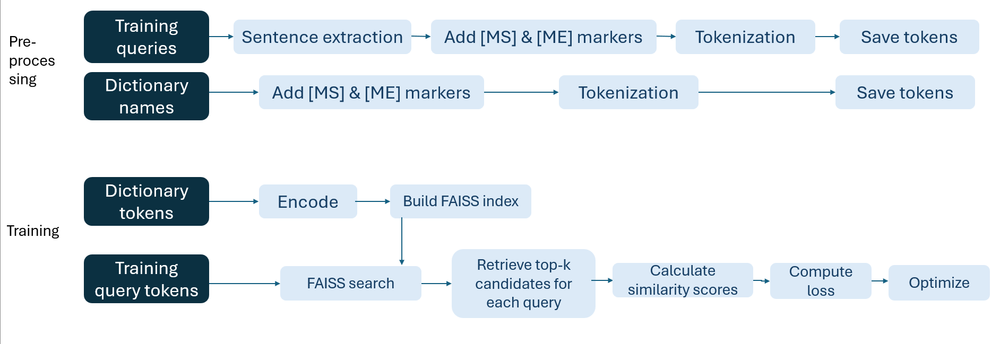
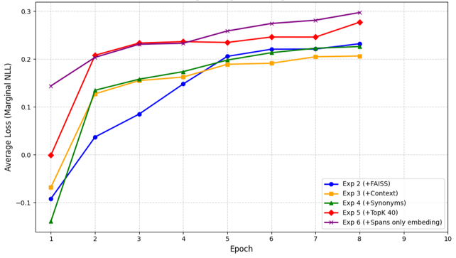
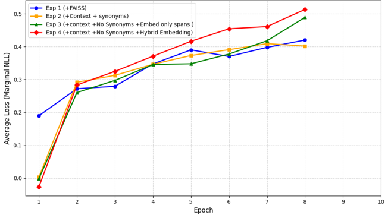
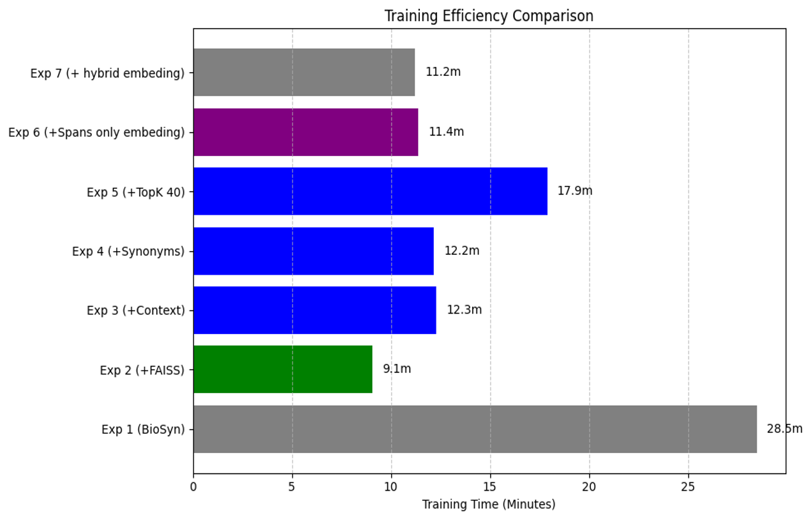
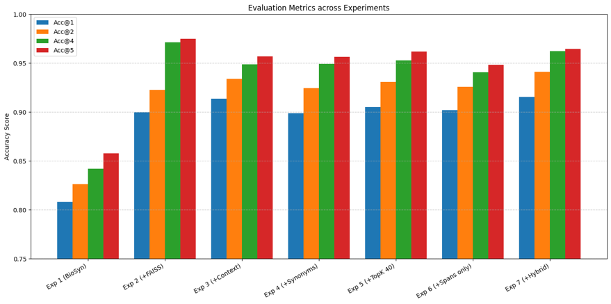
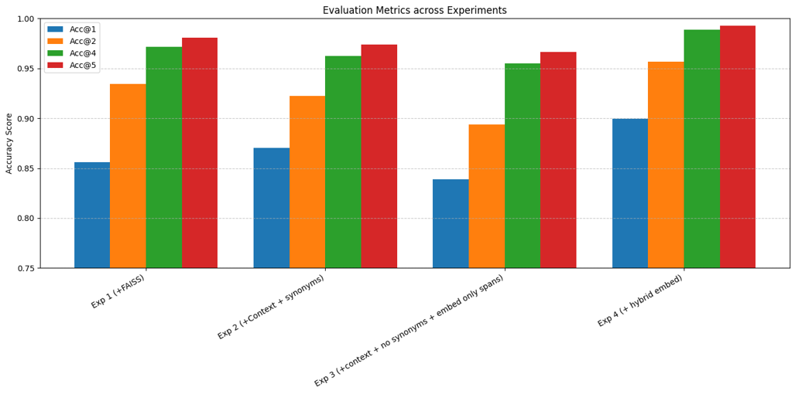

## Full research documentation:
.pdf file available [Improving Bio-Medical Entity Linking via Context-Aware Dense Retrieval](improving_biomedical_entity_linking_via_contextaware_dense_retrieval.pdf)

## BioSyn: State-of-the-Art but Limited

[BioSyn](https://github.com/dmis-lab/BioSyn)

We address two limitations:
#### Scalability Bottleneck:
- BioSyn relies on brute-force matrix multiplication with O(N) complexity..
- Making it impossible to train on the full UMLS knowledge base (4 Million concepts) without Out-Of-Memory errors.
#### Lack of Context Awareness
- BioSyn encodes mentions in isolation, processing only the entity itself (e.g., ‘cold’) without considering surrounding sentence context.
- Making it hard to disambiguate based on the surrounding words.

## Research objectives

#### Objective 1: Scalable Retrieval
Replace brute-force scoring O(N) with FAISS (Facebook AI Similarity Search).

#### Objective 2: Context-Aware Embeddings
We transition from the “mention only” encoding into “full-sentence” encoding.

#### Objective 3: Combined Representation
Combine global sentence context with local mention-specific context.

## Training pipeline:

## Experimental Evaluation
We designed for each benchmark a progressive series of experiments to evaluate the impact of each contribution in our methodology

### Small-scale: NCBI Disease Corpus

##### Exp 1: Baseline BioSyn
The baseline training

##### Exp 2: + FAISS
The baseline training

##### Exp 3: + Context annotation
Tokenizing the whole sentence instead of the mention only, and annotate the mention with the special markers [MS], [ME]

##### Exp 4: + Dictionary synonym augmentation
Each dictionary entry is augmented with up to 5 randomly sampled synonyms

##### Exp 5: + Increase top-k from 20 to 40
Increases the retrieval candidates from the default 20 to 40 candidates

##### Exp 6: - Dictionary synonyms, + Only markers embedding
We removed the dictionary synonym augmentation, and test different encoding mechanism which is using the pool of the embeddings of [MS] and [ME] instead of our combined approach

##### Exp 7: + Combined embedding approach
Increases the retrieval candidates from the default 20 to 40 candidates

### Large-scale: MedMentions Dataset

##### Exp 1: FAISS
##### Exp 2: + Context Annotation + Dictionary Synonyms Augmentation
##### Exp 3: + Only markers embedding
##### Exp 4: + Combined embedding

## Results: 

#### Training Margin
The margin is defined as the difference between the average similarity score of the positive candidates (correct synonyms) and the average similarity score of the negative candidates (hard negatives).
A positive, increasing margin indicates that the model is successfully pushing the correct concepts closer to the query while repelling incorrect ones.

### Training Efficiency:

- 28.5 minutes BioSyn Baseline training time
- 9.1 minutes after FAISS introduction + 4.3 minutes for separate tokenization
- **≈250%** speedup in performance achieved

### Small scale dataset - Accuracy@1:

- Baseline: 80.8%
- Introducing FAISS: 89.99%
- Our context-aware method : 91.55%

### Large scale dataset - Accuracy@1:

- Baseline: OOM (Out Of Memory)
- Introducing FAISS: 85.6%
- Our context-aware method : 89.93%

